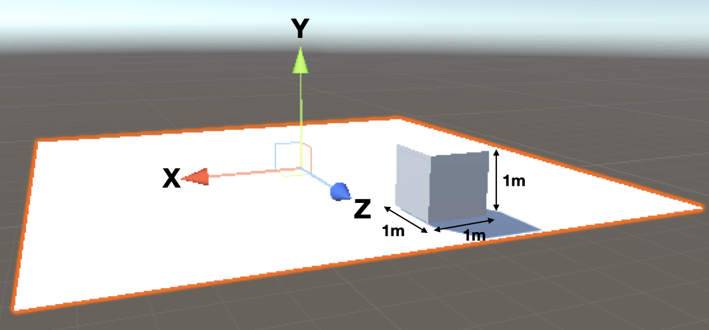

Unity utilise les coordonnées x, y et z pour positionner les objets dans l'espace 3D.

Une unité, la longueur d'un carré de grille, correspond à 1 mètre dans le monde réel.

Si tu ajoutes un plane et ne le fais pas pivoter, alors x et z donnent les coordonnées sur le plane et y donne les coordonnées haut et bas du plane.

Les coordonnées sont données sous la forme d'un "Vector3" ou de trois nombres. Le centre ou la position par défaut du monde est (0, 0, 0).

(0, 1, 0) est une position au centre et à 1 mètre vers le haut.

(1, 0, 1) est une position sur le plane (y = 0) et une unité de distance dans les directions x et z.
